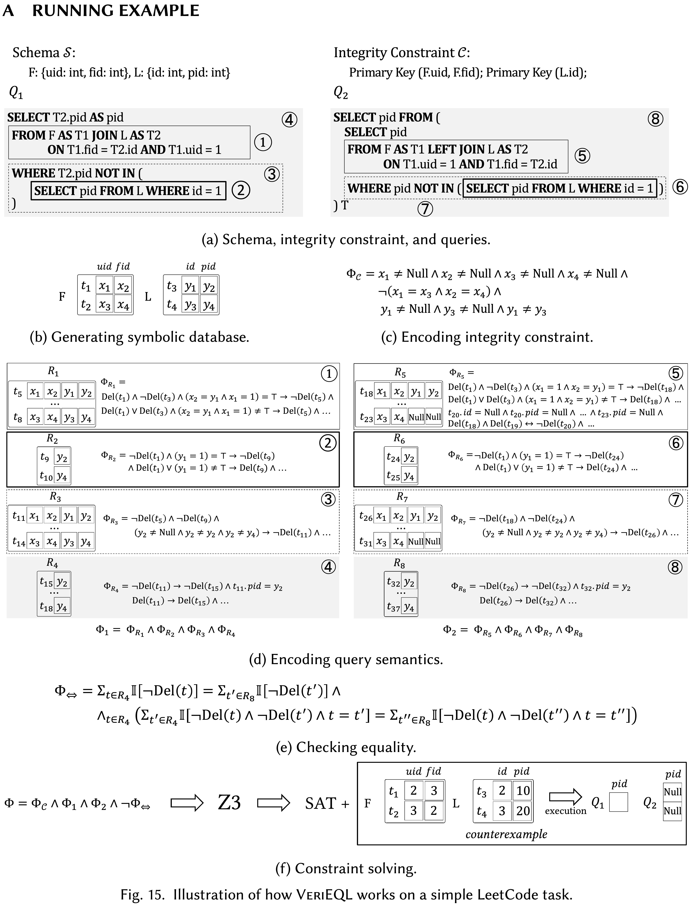

<p align="center">
  
</p>

<br>


## 📝 Introduction

**VeriEQL** is an equivalence verifier for complex SQL queries with integrity constraints using bounded model checking, and reaches S.O.T.A. performance over three benchmark suites.


## ✨ What's new

- We now support **Correlated Subqueries**!

## 🛠️ Installation

### Dependicies
```shell
sudo apt install nodejs
node --version
curl -o- https://raw.githubusercontent.com/nvm-sh/nvm/v0.39.7/install.sh | bash
npm install --global yarn

```

### Prerequisites

- Docker
- Docker composite

## 🔖 How to use

To start VeriEQL, run

```shell
chmod +x verieql.sh && ./verieql.sh
```

1) Test the environment

```shell
python -m test_env
```

2) Try a toy benchmark. Please refer to [run_toy.sh](./verieql/run_toy.sh).
3) Learn VeriEQL in one-shot. Please play [main.py](./verieql/main.py). Very easy to use. :)
4) To reproduce all experimental results, please refer to [experiment.sh](./verieql/experiment.sh) and skip some time- and resource-consuming commands with our records in [history/](./verieql/history).

## ➕ Features

### Syntax


### Semantics

- List semantic (only works for the outermost `OrderBy`)
- Bag semantics

### Formal Encoding

If you have no background about [Z3 solver](https://github.com/Z3Prover/z3) and [the theory of integer and uninterpreted function](https://www.cs.cmu.edu/~15414/f18/lectures/15-real-world-smt.pdf), please refer to the Basics section of [tutorial](https://ericpony.github.io/z3py-tutorial/guide-examples.htm).



## 🐎 Experiments

### Benchmarks

1) [Calcite](./verieql/benchmarks/calcite.jsonlines): 397 pairs
2) [Literature](./verieql/benchmarks/literature.jsonlines): 64 pairs
3) [LeetCode](./verieql/benchmarks/leetcode.jsonlines): 23,994 pairs

### Baselines

- Bounded Model Checking
  - [Cosette](https://github.com/uwdb/Cosette)
  - [Qex](https://github.com/uwdb/Cosette)
- Testing
  - [DataFiller](https://github.com/memsql/datafiller)
  - [XData](https://www.cse.iitb.ac.in/infolab/xdata/)
- Fully Prover
  - [SPES](https://github.com/georgia-tech-db/spes)
  - [HoTTSQL](https://github.com/uwdb/Cosette)

### Comparison

#### RQ1: Coverage and Comparison against State-of-the-Art Techniques

Experimental results on the **ALL** benchmarks.


|       Model       | Unsupported | Checked / Not-refuted / Verified | Refuted / Not-verified |
| :---------------: | :---------: | :------------------------------: | :--------------------: |
| **VeriEQL(ours)** |  **5636**  |            **15200**            |        **3619**        |
|      Cossete      |    24399    |                23                |           33           |
|        Qex        |    24399    |                29                |           27           |
|    DataFiller    |    10722    |              13599              |          134          |
|       XData       |    19451    |               2964               |           1           |
|       SPES       |    24169    |                60                |          226          |
|      HoTTSQL      |    24434    |                21                |           0           |

#### RQ2: Effectiveness at Generating Counterexamples to Facilitate Downstream Tasks

Experimental results on the **ALL** benchmarks.


|       Model       | Genuine |   All   |
| :---------------: | :------: | :------: |
| **VeriEQL(ours)** | **3617** | **3619** |
|      Cossete      |    17    |    33    |
|        Qex        |    14    |    27    |
|    DataFiller    |   325   |   325   |
|       XData       |    1    |    1    |

Bugs Found by VeriEQL

- https://bugs.mysql.com/bug.php?id=110244
- https://issues.apache.org/jira/plugins/servlet/mobile#issue/CALCITE-4617
- https://issues.apache.org/jira/projects/CALCITE/issues/CALCITE-5578?filter=allopenissues
- https://issues.apache.org/jira/browse/CALCITE-5637
- https://issues.apache.org/jira/browse/CALCITE-5516

A SQL pair refuted by VeriEQL.


Please read our paper of *VeriEQL: Bounded Equivalence Verification for Complex SQL Queries with Integrity Constraints* to access proofs, formalization and experimental results.

## 🖥️ Other tools

### Spurious counterexample checker

1) Use MySQL to rule out most genuine counterexamples by [counterexample_checker.py](./verieql/counterexample_checker.py)
   (Note that all benchmarks are collected from different platforms. We must double-check those spurious counterexample manually.)
2) Manually check spurious counterexample at [online databases](https://onecompiler.com/mysql).
3) We found some bugs in MySQL and the LeetCode benchmarks. Please refer to [reported_bugs.csv](./verieql/reported_bugs.csv).

### Z3 Acceleration

We modify the source code of the Z3 solver to accelerate formalization. According to our observation, it can gain 1.1x ~ 3x speedup in formalization.

## Citation

If you use this tool in your research, please cite this project as follows,

```latex
TBA
```

## 📄 License

**This repo is currently under a patent evaluation!**

[//]: #
