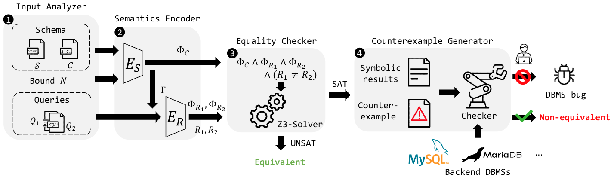
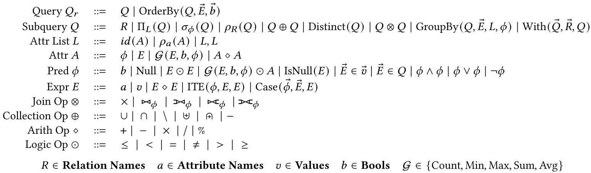

<p align="center">
  
</p>

<br>


## 📝 Introduction

**VeriEQL** is an equivalence verifier for complex SQL queries with integrity constraints using bounded model checking, and reaches S.O.T.A. performance over three benchmark suites.



[//]: # (## ✨ What's new)

[//]: # ()
[//]: # (- We now support **Correlated Subqueries**!)

## 🛠️ Installation

### Dependencies

- NodeJS & NextJS
- npm & yarn

```shell
sudo apt install nodejs
node --version
curl -o- https://raw.githubusercontent.com/nvm-sh/nvm/v0.39.7/install.sh | bash
npm install --global yarn next
```

[//]: # (### Prerequisites)

[//]: # ()
[//]: # (- Docker)

[//]: # (- Docker composite)

## 🔖 How to use

backend: initialize a Python environment for VeriEQL.
```shell
cd backend
pip install -r requirements.txt
python -m uvicorn main:app --reload
# visit http://localhost:8000 to ensure the backend is activated
```

frontend: 
```shell
cd frontend
python -m http.server 3000
# visit http://localhost:3000 to use VeriEQL's web system
```


## ➕ Features

### Syntax



### Semantics

- List semantic (only works for the outermost `OrderBy`)
- Bag semantics

### Formal Encoding

If you have no background about [Z3 solver](https://github.com/Z3Prover/z3) and [the theory of integer and uninterpreted function](https://www.cs.cmu.edu/~15414/f18/lectures/15-real-world-smt.pdf), please refer to the Basics section of [tutorial](https://ericpony.github.io/z3py-tutorial/guide-examples.htm).

[//]: # (![Encoding.]&#40;__figures__/encoding.png&#41;)

## 🐎 Experiments

### Benchmarks

1) [Calcite](./verieql/benchmarks/calcite.jsonlines): 397 pairs
2) [Literature](./verieql/benchmarks/literature.jsonlines): 64 pairs
3) [LeetCode](./verieql/benchmarks/leetcode.jsonlines): 23,994 pairs

### Baselines

- Bounded Model Checking
  - [Cosette](https://github.com/uwdb/Cosette)
  - [Qex](https://github.com/uwdb/Cosette)
- Testing
  - [DataFiller](https://github.com/memsql/datafiller)
  - [XData](https://www.cse.iitb.ac.in/infolab/xdata/)
- Fully Prover
  - [SPES](https://github.com/georgia-tech-db/spes)
  - [HoTTSQL](https://github.com/uwdb/Cosette)

### Comparison

#### RQ1: Coverage and Comparison against State-of-the-Art Techniques

Experimental results on the **ALL** benchmarks.


|       Model       | Unsupported | Checked / Not-refuted / Verified | Refuted / Not-verified |
| :---------------: | :---------: | :------------------------------: | :--------------------: |
| **VeriEQL(ours)** |  **5636**  |            **15200**            |        **3619**        |
|      Cossete      |    24399    |                23                |           33           |
|        Qex        |    24399    |                29                |           27           |
|    DataFiller    |    10722    |              13599              |          134          |
|       XData       |    19451    |               2964               |           1           |
|       SPES       |    24169    |                60                |          226          |
|      HoTTSQL      |    24434    |                21                |           0           |

#### RQ2: Effectiveness at Generating Counterexamples to Facilitate Downstream Tasks

Experimental results on the **ALL** benchmarks.


|       Model       | Genuine |   All   |
| :---------------: | :------: | :------: |
| **VeriEQL(ours)** | **3617** | **3619** |
|      Cossete      |    17    |    33    |
|        Qex        |    14    |    27    |
|    DataFiller    |   325   |   325   |
|       XData       |    1    |    1    |

Bugs Found by VeriEQL

- https://bugs.mysql.com/bug.php?id=110244
- https://issues.apache.org/jira/plugins/servlet/mobile#issue/CALCITE-4617
- https://issues.apache.org/jira/projects/CALCITE/issues/CALCITE-5578?filter=allopenissues
- https://issues.apache.org/jira/browse/CALCITE-5637
- https://issues.apache.org/jira/browse/CALCITE-5516

A SQL pair refuted by VeriEQL.


[//]: # (Please read our paper of *VeriEQL: Bounded Equivalence Verification for Complex SQL Queries with Integrity Constraints* to access proofs, formalization and experimental results.)

[//]: # (## 🖥️ Other tools)

[//]: # ()
[//]: # (### Spurious counterexample checker)

[//]: # ()
[//]: # (1&#41; Use MySQL to rule out most genuine counterexamples by [counterexample_checker.py]&#40;./verieql/counterexample_checker.py&#41;)

[//]: # (   &#40;Note that all benchmarks are collected from different platforms. We must double-check those spurious counterexample manually.&#41;)

[//]: # (2&#41; Manually check spurious counterexample at [online databases]&#40;https://onecompiler.com/mysql&#41;.)

[//]: # (3&#41; We found some bugs in MySQL and the LeetCode benchmarks. Please refer to [reported_bugs.csv]&#40;./verieql/reported_bugs.csv&#41;.)

[//]: # (### Z3 Acceleration)

[//]: # ()
[//]: # (We modify the source code of the Z3 solver to accelerate formalization. According to our observation, it can gain 1.1x ~ 3x speedup in formalization.)

[//]: # ()
[//]: # (## Citation)

[//]: # ()
[//]: # (If you use this tool in your research, please cite this project as follows,)

[//]: # ()
[//]: # (```latex)

[//]: # (TBA)

[//]: # (```)

## 📄 License

**The VeriEQL's backend is currently under a patent evaluation! If you want to explore it, please drop an email to us (yha244@sfu.ca).**

[//]: #
